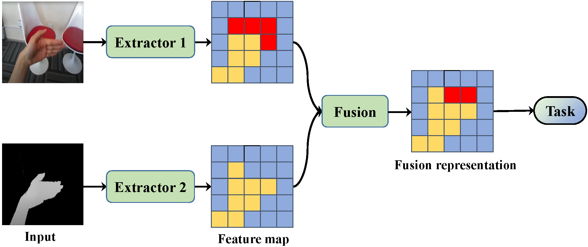

## Countering Modal Redundancy and Heterogeneity: A Self-Correcting Multimodal Fusion

This is the PyTorch implementation of ICDM2022 paper 'Countering Modal Redundancy and Heterogeneity: A Self-Correcting Multimodal Fusion'. 

We propose a unified multimodal fusion strategy to counter modal redundancy and heterogeneity. For heterogeneity, we design a groundbreaking UFIM approach, which can effectively extract and transfer inter-modal fine-grained correlations among features with its inbuilt orthogonal attention and interactive feedback, achieving unified modal interactions. For redundancy, we utilize a novel SCTM to obtain the one-to-many modal correlation information to alleviate two kinds of redundancies in different ways.

